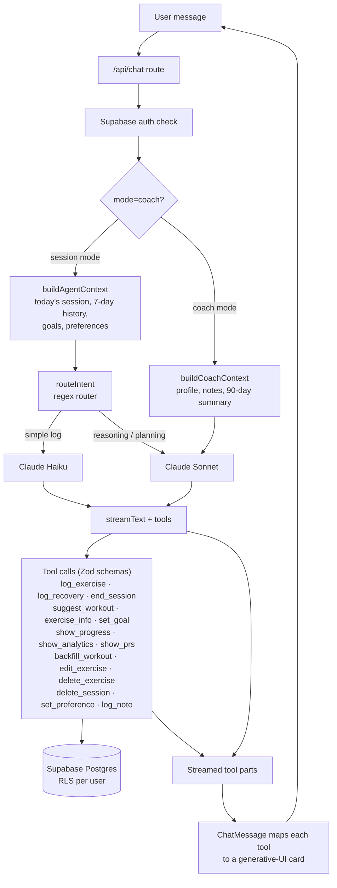

# Gym Agent

A conversational gym tracker where you log workouts in plain English and a Claude-powered agent responds with interactive cards instead of plain text.

You type things like "bench press 3x8 at 60kg, RPE 8" or "what should I do today?". The agent parses the message, calls the right tool, and the result renders as a generative-UI component — an exercise log card, a suggested workout plan, a progress chart, a PR dashboard, and so on. It's built on Next.js (App Router) with the Vercel AI SDK and `@ai-sdk/anthropic`, with Supabase for auth and persistence (Row Level Security scopes every row to its user).

<!-- SCREENSHOTS: add 2-3 here -->

## Architecture

The agent loop runs in a single streaming API route (`app/api/chat/route.ts`):



Two things worth calling out:

- **Model routing.** `lib/agent/router.ts` uses a regex matcher to send simple logging messages to a cheaper/faster model and route greetings, recommendations, form questions, analytics, and edits to a stronger one. Coach mode always uses the stronger model.
- **Generative UI.** Tools don't return prose. Each tool's typed output is matched by name in `components/chat/ChatMessage.tsx` and rendered as a dedicated React card under `components/generative-ui/`.

## How the agent works

Tools are defined with the AI SDK `tool()` helper and Zod input schemas. There are two tool sets:

**Session tools** (`lib/agent/tools.ts`) — used in the main workout-logging flow:

| Tool | What it does |
|------|--------------|
| `log_exercise` | Parse and stage a single exercise (sets/reps/weight, units, RPE/RIR, optional per-set `set_details`) for user confirmation |
| `log_recovery` | Log foam rolling, stretching, massage gun, etc. |
| `end_session` | End the current session and show a summary |
| `suggest_workout` | Propose a plan; enriches each exercise with the user's last log and PR from Supabase |
| `exercise_info` | Return structured form cues, target muscles, and common mistakes |
| `set_goal` | Create/update a fitness goal |
| `set_preference` | Persist preferences (`default_reps`, `weight_unit`) to `user_profile.preferences` |
| `show_progress` | Per-exercise history with computed volume, estimated 1RM (Epley), trend, and frequency; `view='chart'` switches to a graph |
| `show_analytics` | Training volume and muscle-group distribution over a window of weeks |
| `show_prs` | Personal records across all exercises with improvement % and estimated 1RM |
| `backfill_workout` | Persist a past-dated session directly (no confirmation) |
| `edit_exercise` | Update a previously logged exercise in today's session |
| `delete_exercise` | Remove one or all matching exercises from today's session |
| `delete_session` | Delete an entire session and its logs |

**Coach tools** (`lib/agent/coach-tools.ts`) — a read/advice-oriented subset used in coach mode (no live-session logging): `log_note`, `suggest_workout`, `set_goal`, `show_progress`, `exercise_info`, `set_preference`, `show_analytics`, `show_prs`.

Some tools (`log_exercise`, `log_recovery`, `set_goal`) stage data and return `pending_confirmation` so the UI can ask the user to confirm before it's written. Read and edit/delete tools execute against Supabase directly inside their `execute` handler. The route caps the agent at a few steps per turn (`stepCountIs(3)`).

Context for each turn is assembled by `lib/agent/context-builder.ts` (session mode) and `lib/agent/coach-context-builder.ts` (coach mode) and injected into the system prompt (`lib/agent/prompts.ts`, `lib/agent/coach-prompts.ts`).

## Tech stack

- **Next.js 16** (App Router) + **React 19**
- **Vercel AI SDK v6** (`ai`, `@ai-sdk/react`) with **`@ai-sdk/anthropic`** (Claude)
- **Supabase** — Postgres, Auth, and Row Level Security (`@supabase/ssr`, `@supabase/supabase-js`)
- **Zod** for tool input schemas
- **Chart.js** + `react-chartjs-2` for progress/analytics charts
- **Tailwind CSS v4**, **Motion** for animation
- **date-fns** for date math
- TypeScript throughout; PWA manifest + service worker in `public/`

## Data model

Supabase migrations live in `supabase/migrations/`. Core tables: `user_profile` (with JSONB `preferences`), `workout_sessions`, `exercise_logs` (with JSONB `set_details` and `rpe`/`rir`), `recovery_logs`, `goals`, `user_notes`, and chat persistence (`chats` / `chat_messages`). Every table has Row Level Security enabled with a per-user "manage own rows" policy.

## Local setup

Requirements: Node.js 20+ and a Supabase project.

```bash
# 1. Install
npm install

# 2. Configure environment
cp .env.example .env.local
# then fill in ANTHROPIC_API_KEY and your Supabase URL/keys

# 3. Apply the database schema
#    Run the SQL files in supabase/migrations/ in order (001, 003, 004, ...)
#    via the Supabase SQL editor or the Supabase CLI.

# 4. Run the dev server
npm run dev
```

Open http://localhost:3000. Unauthenticated requests are redirected to `/login` by `middleware.ts`, so sign up/in first, then start logging.

### Environment variables

| Variable | Required | Notes |
|----------|----------|-------|
| `ANTHROPIC_API_KEY` | yes | Read automatically by `@ai-sdk/anthropic` |
| `NEXT_PUBLIC_SUPABASE_URL` | yes | Public Supabase project URL |
| `NEXT_PUBLIC_SUPABASE_ANON_KEY` | yes | Public anon key |
| `SUPABASE_SERVICE_ROLE_KEY` | yes | Server-only; bypasses RLS — keep secret |

## Scripts

```bash
npm run dev     # start dev server
npm run build   # production build
npm run start   # serve the production build
npm run lint    # eslint
```

## Project layout

```
app/
  api/chat/route.ts     # the agent loop (streaming, model routing, tools)
  api/export/route.ts   # CSV export of all sessions
  page.tsx history/ stats/ login/
components/
  chat/                 # chat container, input, message renderer
  generative-ui/        # one React card per tool output
lib/
  agent/                # tools, prompts, context builders, router
  supabase/             # client/server helpers + types
supabase/migrations/    # SQL schema (RLS policies included)
```
